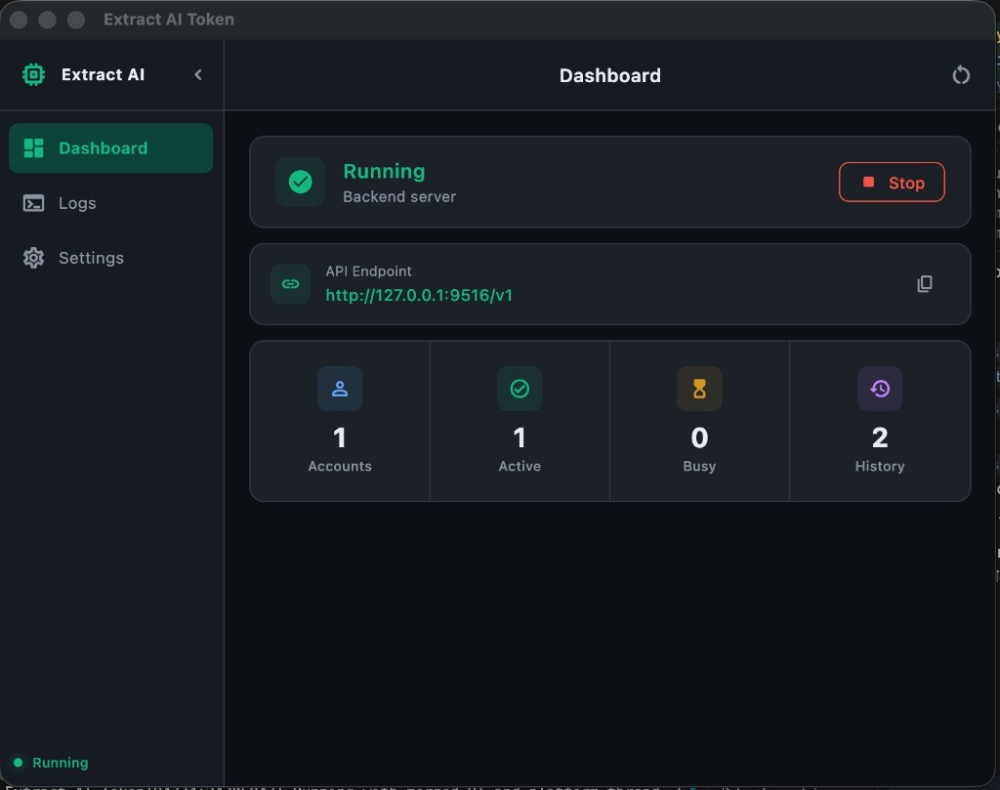
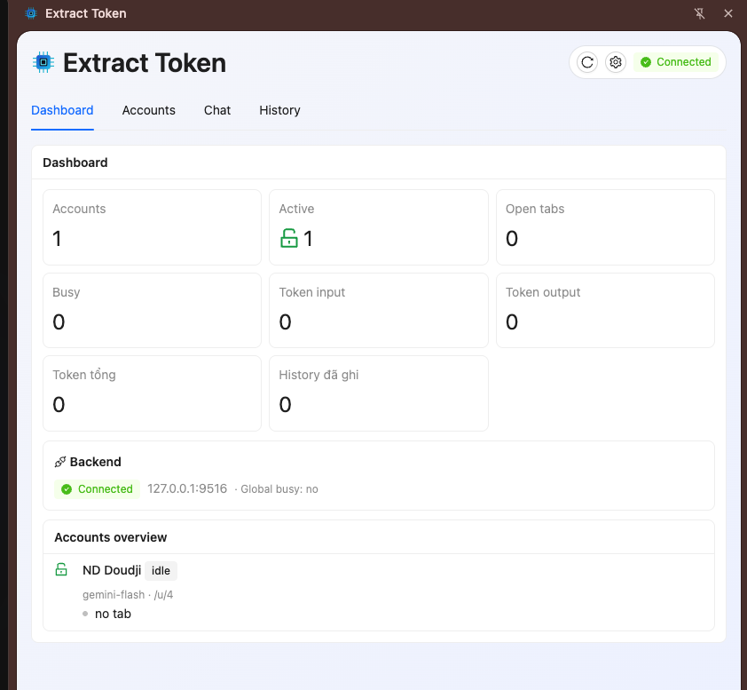
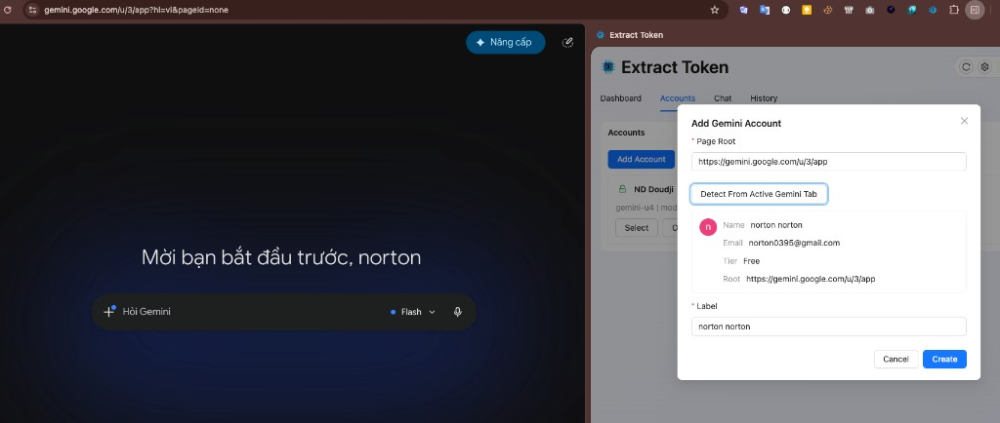
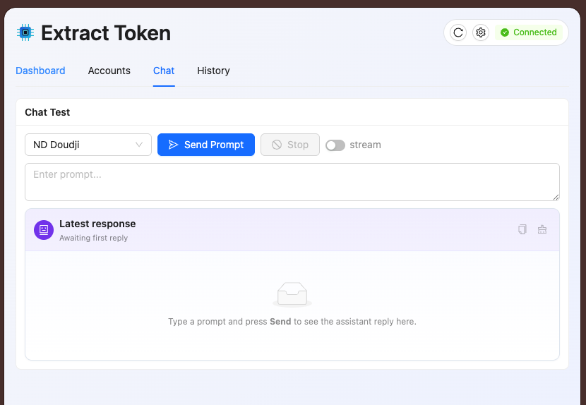

# Extract Token

> **Tiếng Việt:** [README-vn.md](README-vn.md)

**Extract Token** helps you work with multiple Gemini accounts in Chrome from one place: manage accounts, open the right tab per account, send prompts, and keep chat history—while a small **desktop app** runs the local data service on your machine.

## Screenshots

Two main pieces: the **desktop app** (tray, starts the backend) and the **Chrome extension** (side panel for accounts and chat).

### Desktop app

Dashboard: backend status, API URL (`http://127.0.0.1:9516/v1`), account/history stats.



### Chrome extension (side panel)

| Screen | Description |
|--------|-------------|
| Dashboard | Accounts, tabs, tokens, backend connection |
| Add account | Detect profile from the active Gemini tab |
| Chat | Send test prompts, optional stream, view replies |

#### Extension dashboard



#### Add Gemini account

Open a Gemini tab → **Accounts** → **Add Account** → **Detect From Active Gemini Tab** → **Create**.



#### Extension chat



## Message & API capabilities

| Capability | Status | Notes |
|------------|:------:|-------|
| **Text** prompts (side panel, API) | ✅ | Plain text in the Chat tab and `messages[].content` as a string (or multipart with `type: "text"` only) |
| **Tools** / function calling | ✅ | OpenAI-compatible `tools`, `tool_calls`, and multi-turn `tool` messages — see [Example 5](#example-5--chat-from-your-own-script-openai-compatible) |
| **Files** (attachments, uploads) | ❌ | Not supported yet |
| **Images** (vision / multimodal) | ❌ | Not supported yet — `image_url` and other non-text parts in `content` are ignored |

## Platform support

### Operating systems

| Component | macOS | Windows | Linux |
|-----------|:-----:|:-------:|:-----:|
| **Chrome extension** (side panel) | ✅ | ✅ | ✅ |
| **Desktop app** (tray + backend launcher) | ✅ | ✅ | ✅ |
| **Local backend** (SQLite, API, WebSocket) | ✅ | ✅ | ✅ |
| **Backend in Docker** (API on host) | ✅ | ✅ | ✅ |

The backend listens on your machine by default (`127.0.0.1:9516`). You can also run the backend in **Docker** (port mapped to the host); the Chrome extension still runs on the same machine — see [C. Docker](#c-docker).

### Browsers (extension)

Works in **Chromium-based** browsers that support **Manifest V3** and the **Side Panel** API (same extension package: `chrome-mv3`).

| Browser | Supported | Notes |
|---------|:---------:|-------|
| Google Chrome | ✅ | Recommended; Chrome 114+ for side panel |
| Microsoft Edge | ✅ | Load unpacked extension |
| Brave, Arc, Chromium, etc. | ✅ | If MV3 + side panel are available |
| Firefox | ❌ | Different extension format (not included) |
| Safari | ❌ | Not supported |

### AI / web targets

| Service | Supported | Notes |
|---------|:---------:|-------|
| **Google Gemini** | ✅ | Primary; extension runs on `gemini.google.com` |
| **ChatGPT** | — | Listed in account types only; no web automation yet |

### Desktop app notes by OS

| OS | Tray | Backend binary (bundled / build) |
|----|------|----------------------------------|
| **macOS** | Menu bar icon | `macos-backend` / `Resources/backend` |
| **Windows** | Notification area | `windows-backend.exe` next to the app |
| **Linux** | System tray (depends on desktop environment) | `linux-backend` next to the app |

On **Linux**, **Copy API URL** from the tray may need `wl-copy`, `xclip`, or `xsel` installed if the clipboard shortcut fails.

### Not supported

- **File** and **image** inputs in chat or API (text and tools only for now)
- Mobile (iOS / Android)
- Firefox / Safari extension install
- Using the extension without a **local** backend on the same machine (default setup)

## What you need

| Item | Notes |
|------|--------|
| **Chromium browser** | Chrome, Edge, or compatible — for the extension |
| **Desktop OS** | macOS, Windows, or Linux — for the tray app that runs the backend |
| **Gemini account(s)** | Signed in at [gemini.google.com](https://gemini.google.com) in the browser |

## Running `extract-ai-token` (CLI) and the desktop app

You can run the local API in two ways: the **desktop app** (tray + UI, starts the backend for you) or the **`extract-ai-token` CLI** (backend only). Both use the same port and API (`127.0.0.1:9516` by default).

### Download (GitHub Releases)

On tagged releases (`v*.*.*`), pick the asset for your OS:

| Asset | Contents |
|-------|----------|
| `extract-ai-token-backend-macos.zip` | CLI `extract-ai-token` (macOS, universal) |
| `extract-ai-token-backend-windows.zip` | CLI `extract-ai-token.exe` |
| `extract-ai-token-backend-linux.tar.gz` | CLI `extract-ai-token` |
| `extract-ai-token-v*-macos.dmg` | macOS installer (drag app to Applications) |
| `extract-ai-token-v*-macos.zip` | macOS `.app` zip (alternative) |
| `extract-ai-token-windows.zip` | Windows app folder + `backend.exe` |
| `extract-ai-token-linux.tar.gz` | Linux `bundle/` + `backend` |

Extension zip is published separately (`extension-chrome`).

### A. Desktop app (recommended)

**macOS**

1. Download **`extract-ai-token-v*-macos.dmg`** from the release (signed + notarized when [release secrets](docs/MACOS_SIGNING.md) are configured).
2. Open the DMG → drag **Extract AI Token** to **Applications**.
3. Launch from Applications (or Spotlight). The backend starts automatically; look for the **menu bar** icon.
4. **Open Dashboard** from the tray to confirm **Running**.

Alternatively, use the `.zip` asset: unzip, then open **Extract AI Token.app**.

If macOS says *“Apple could not verify…”* (unsigned local/dev build):

- **Right-click** the app → **Open** → **Open** once, or run:

  ```bash
  xattr -cr "/Applications/Extract AI Token.app"
  ```

Maintainers: see [docs/MACOS_SIGNING.md](docs/MACOS_SIGNING.md) to enable **Developer ID signing + notarization** on release tags.

**Windows**

1. Unzip `extract-ai-token-windows.zip`.
2. Run **`app.exe`** from the `Release` folder (same folder contains `backend.exe`).
3. Use the **system tray** icon → Dashboard / Settings.

**Linux**

1. Extract `extract-ai-token-linux.tar.gz`.
2. From the `bundle` folder:

   ```bash
   chmod +x app backend
   ./app
   ```

3. Use the **tray** menu; on some desktops you may need a AppIndicator-compatible panel.

**Dev run from the repo** (Flutter SDK required):

```bash
# 1) Build backend into build/ (names must match what the app expects)
cd backend && cargo build --release
cd ..
mkdir -p build
cp backend/target/release/backend build/macos-backend          # macOS
# cp backend/target/release/backend.exe build/windows-backend.exe  # Windows
# cp backend/target/release/backend build/linux-backend            # Linux

# 2) Run the Flutter app
cd app
flutter pub get
flutter run -d macos      # or: windows, linux
```

Release build:

```bash
cd app && flutter build macos --release    # macos | windows | linux
```

Then copy the backend binary next to the built app (see [`.github/workflows/release.yml`](.github/workflows/release.yml) for exact paths).

---

### B. CLI only — `extract-ai-token`

Standalone backend process (no tray UI). Use this if you only need the HTTP/WebSocket API or you will start the service from a script.

**macOS / Linux**

```bash
unzip extract-ai-token-backend-macos.zip   # or extract .tar.gz on Linux
chmod +x extract-ai-token
./extract-ai-token
```

**Windows (PowerShell)**

```powershell
Expand-Archive extract-ai-token-backend-windows.zip -DestinationPath .
.\extract-ai-token.exe
```

**Environment variables**

| Variable | Default | Description |
|----------|---------|-------------|
| `APP_ADDR` | `127.0.0.1:9516` | Listen address (`host:port`) |
| `SQLITE_PATH` | `data/app.db` | SQLite file (created relative to cwd) |
| `RUST_LOG` | `info` | Log level (`debug`, `info`, …) |

**Examples**

```bash
# Default port and DB in ./data/app.db
./extract-ai-token

# Custom port
APP_ADDR=127.0.0.1:9516 ./extract-ai-token

# Custom database path
SQLITE_PATH="$HOME/.extract-ai-token/app.db" ./extract-ai-token
```

Check it is up:

```bash
curl http://127.0.0.1:9516/health
```

Stop with `Ctrl+C` in the terminal.

**Point the desktop app at your own CLI binary** (optional):

```bash
export AI_BROWSER_BACKEND_BIN=/absolute/path/to/extract-ai-token
open app.app   # macOS — app will spawn that binary instead of the bundled one
```

**Build the CLI from source**

```bash
cd backend
cargo build --release
# Binary: backend/target/release/backend (rename to extract-ai-token if you like)
./target/release/backend
```

macOS universal binary (optional, matches CI):

```bash
rustup target add aarch64-apple-darwin x86_64-apple-darwin
cd backend
cargo build --release --target aarch64-apple-darwin
cargo build --release --target x86_64-apple-darwin
lipo -create \
  target/aarch64-apple-darwin/release/backend \
  target/x86_64-apple-darwin/release/backend \
  -output ../build/extract-ai-token
chmod +x ../build/extract-ai-token
```

> **Note:** Run only one backend per port — CLI, desktop app, **or** Docker container — not more than one on the same host port.

### C. Docker

The image runs the **backend API only** (no desktop app or extension). The extension and Gemini tabs stay on the host; the container serves `http://127.0.0.1:9516` when the port is mapped.

Details: [docs/DOCKER.md](docs/DOCKER.md).

**Build image**

```bash
./scripts/docker-build.sh
# or: docker build -t extract-ai-token:latest .
```

**Run (Compose)**

```bash
docker compose up -d
curl http://127.0.0.1:9516/health
```

**Quick run (`docker run`)**

```bash
docker run -d --name extract-ai-token \
  -p 9516:9516 \
  -v extract-ai-token-data:/data \
  extract-ai-token:latest
```

| Variable (container) | Default | Notes |
|----------------------|---------|--------|
| `APP_ADDR` | `0.0.0.0:9516` | Must bind `0.0.0.0` inside the container |
| `SQLITE_PATH` | `/data/app.db` | Mount a volume at `/data` |

**GHCR images** (on tag push `v*.*.*`): `ghcr.io/<owner>/<repo>:<version>` — see [`.github/workflows/docker.yml`](.github/workflows/docker.yml).

In the extension **Settings**, use host `127.0.0.1` and port `9516` (or your `EXTRACT_TOKEN_PORT` host mapping).

## Getting started

### 1. Start the backend (desktop app or CLI)

**Using the desktop app:** open the app for your OS (see [A. Desktop app](#a-desktop-app-recommended) above). Confirm **Running** in the tray or Dashboard.

**Using the CLI only:** run `./extract-ai-token` (see [B. CLI only](#b-cli-only--extract-ai-token) above), then point the Chrome extension to the same host/port.

**Using Docker:** `docker compose up -d` (see [C. Docker](#c-docker)); point the extension at `127.0.0.1` and the mapped port.

**Tray menu:**

| Action | What it does |
|--------|----------------|
| Open Dashboard | Status, API URL, account/history counts |
| Open Logs | Backend log output |
| Open Settings | Change port, local vs network bind |
| Copy API URL | Copies `http://127.0.0.1:<port>` for the extension |
| Start / Restart / Stop Backend | Control the local service |

Closing the app window hides it; the app keeps running in the tray. Quit fully from the tray menu when you want to stop everything.

**Settings (desktop app):**

- **Port** — default `9516`; must match the port in the Chrome extension.
- **Public bind** — off (recommended): localhost only (`127.0.0.1`). On: listens on all interfaces (`0.0.0.0`); use only on trusted networks.

After changing port or bind, use **Save & Restart** in Settings.

### 2. Install the Chrome extension

1. In Chrome, open `chrome://extensions`.
2. Turn on **Developer mode** (if you install from a local folder).
3. Click **Load unpacked** and select the `chrome-mv3` folder from your Extract Token package.
4. Pin the extension if you like; open the **side panel** (extension icon or Chrome side panel menu).

### 3. Connect extension ↔ backend

1. Open the **Extract Token** side panel.
2. Check the badge in the header:
   - **Connected** — extension is talking to the backend.
   - **Disconnected** — backend is off or host/port is wrong.
3. If disconnected:
   - Click **Settings** (gear) → set **Host** (`127.0.0.1`) and **Port** (same as the desktop app, usually `9516`) → **Save & Reconnect**.
   - Or click **Reconnect** (reload icon) after the desktop app shows **Running**.

The panel still opens when the backend is down; accounts and history sync once the connection is back.

## Using the side panel

The panel has four tabs. Data refreshes automatically every few seconds.

### Dashboard

Overview at a glance:

- Number of accounts (active / locked)
- Open Gemini tabs and **busy** accounts (currently processing a prompt)
- History message count
- Backend connection (`host:port`, connected or not)

Use this tab to see whether everything is healthy before sending chats.

### Accounts

Manage Gemini profiles:

1. Click **Add Account**.
2. In Chrome, open the Gemini tab for the account you want to add (logged in).
3. In the dialog, click **Detect From Active Gemini Tab** — fills **Page Root** and suggests a **Label** (name, email, tier).
4. Click **Create**.

Per account:

| Button | Action |
|--------|--------|
| Lock / Unlock | Disabled accounts are skipped for automation |
| Select | Chooses account for the Chat tab |
| Open Tab | Opens or focuses the Gemini tab for that account |
| Delete | Removes the account from storage |

Each account is tied to a Gemini URL (for example `https://gemini.google.com/u/0/app` or a custom page root).

### Chat

Send a **text-only** test prompt through the extension (uses the selected account’s Gemini tab). File and image uploads are not supported yet.

1. Choose an **account** in the dropdown.
2. Type your message in the text box.
3. Click **Send Prompt** — wait for **Latest response** below.
4. **Stop** — cancel generation while it is running.
5. **stream** — optional streaming mode (OpenAI-compatible SSE).
6. **Copy** — copy the latest response text.

The account must be **unlocked** and its tab should be open (use **Open Tab** on the Accounts tab if needed).

### History

Shows recent user/assistant messages stored while the backend was connected.

- **Clear History** — removes all stored history (cannot be undone from the panel).

## Typical workflow

1. Start the **desktop app** → backend **Running**.
2. Open Chrome → **side panel** shows **Connected**.
3. **Accounts** → add each Gemini profile (detect from the active tab).
4. **Open Tab** for the account you want to use.
5. **Chat** → select account → send prompts; check **History** for past turns.
6. **Dashboard** → monitor busy state when running several accounts.

## Examples

### Example 1 — First-time setup (one Gemini account)

| Step | Action |
|------|--------|
| 1 | Start **Extract AI Token** (desktop app) → tray shows **● Running (port 9516)** |
| 2 | In Chrome, open [gemini.google.com](https://gemini.google.com) and sign in |
| 3 | Open the **Extract Token** side panel → badge **Connected** |
| 4 | **Accounts** → **Add Account** → **Detect From Active Gemini Tab** → **Create** |
| 5 | **Open Tab** — extension opens/focuses the Gemini page for that account |
| 6 | **Chat** → choose the account → type a prompt → **Send Prompt** |

### Example 2 — Work and personal (two Google profiles)

Use one Chrome profile or multiple; each signed-in Gemini URL becomes an account:

| Account label | Gemini URL (example) | Detect from tab |
|---------------|----------------------|-----------------|
| Work | `https://gemini.google.com/u/0/app` | Open that URL → Add Account → Detect |
| Personal | `https://gemini.google.com/u/1/app` | Switch Google account in Chrome → open `/u/1/app` → Detect again |

Then in **Chat**, pick **Work** or **Personal** from the dropdown before sending. Use **Dashboard** to see both accounts and which tab is open.

### Example 3 — Check the backend is up

```bash
curl http://127.0.0.1:9516/health
```

Expected: HTTP `200` and a healthy response while the desktop app reports **Running**.

List configured accounts (after you added them in the extension):

```bash
curl http://127.0.0.1:9516/v1/accounts
```

### Example 4 — Chat from the side panel

1. **Accounts** → **Open Tab** for `Work`.
2. **Chat** → account **Work** → prompt:

   `List three pros and cons of remote work in bullet points.`

3. Click **Send Prompt** → read **Latest response** → **Copy** if needed.
4. Turn on **stream** to watch tokens arrive incrementally (SSE).
5. **History** → last user/assistant lines appear after a successful send.

### Example 5 — Chat from your own script (OpenAI-compatible)

Backend URL: `http://127.0.0.1:9516` (change port if you changed it in Settings).

**curl (one-shot reply):**

```bash
curl -s http://127.0.0.1:9516/v1/chat/completions \
  -H "Content-Type: application/json" \
  -d '{
    "model": "gemini-flash",
    "stream": false,
    "messages": [{ "role": "user", "content": "What time is it in UTC?" }]
  }'
```

Optional: pin a specific account (ID from `GET /v1/accounts` or the Accounts tab):

```json
"account_id": "gemini-0"
```

**Node.js (ready-made scripts in the repo):**

```bash
cd examples/nodejs
node accounts.mjs
node chat.mjs "what time is it?"
node chat-stream.mjs "haiku about coffee"

npm install
node openai-sdk.mjs "say hi"
STREAM=1 node openai-sdk.mjs "stream me a fact"
node tools.mjs
```

The API supports **text** and **tools** / **tool_calls** (OpenAI-style function calling): send a `tools[]` array in the body; when the model returns tool JSON, the response uses `finish_reason: "tool_calls"`. **Files** and **images** are not supported yet.

| Variable | Default | Meaning |
|----------|---------|---------|
| `BASE_URL` | `http://127.0.0.1:9516` | Backend base URL |
| `MODEL` | `gemini-flash` | Model name sent to the API |
| `ACCOUNT_ID` | first enabled account | Which Gemini account to use |
| `STREAM` | `0` | Set `1` for streaming in `openai-sdk.mjs` |

Full request/response shapes and more scripts: [`examples/nodejs/README.md`](examples/nodejs/README.md).

**Python (OpenAI SDK):**

```python
from openai import OpenAI

client = OpenAI(
    base_url="http://127.0.0.1:9516/v1",
    api_key="not-used",  # backend ignores auth; placeholder required by SDK
)

reply = client.chat.completions.create(
    model="gemini-flash",
    messages=[{"role": "user", "content": "Say hello in Vietnamese"}],
)
print(reply.choices[0].message.content)
```

Prerequisites for API examples: desktop app **Running**, at least one **enabled** account in the extension, and the matching Gemini tab open when sending chat requests.

## Troubleshooting

| Problem | What to try |
|---------|-------------|
| **Disconnected** in the panel | Start or restart the backend in the desktop app; match host/port in extension Settings. |
| Warning about backend error | Read the message in the panel; open **Logs** in the desktop app. |
| Detect account fails | Active tab must be a Gemini page (`gemini.google.com`); refresh and try again. |
| Send prompt fails | Unlock account, open its tab, wait until Gemini UI is ready. |
| Port already in use | Change port in desktop app **Settings**, save, then update the same port in the extension. |
| Tray missing on Linux | Check your desktop environment’s system tray support; restart the app. |
| Extension won’t load | Use a Chromium browser with MV3; enable side panel support (Chrome 114+). |
| No history after chat | Backend must be **Connected** when sending; history is stored on the local service. |
| macOS “could not verify” / malware warning | Use a **notarized** release DMG, or right-click → **Open** / `xattr -cr` (see [MACOS_SIGNING.md](docs/MACOS_SIGNING.md)). |

## Disclaimer

This project is provided for learning, research, personal experimentation, and internal validation only. No commercial authorization is granted, and no warranty of stability, fitness, or results is provided. The author and repository maintainers are not responsible for any direct or indirect loss, account suspension, data loss, legal risk, or third-party claims arising from use, modification, distribution, deployment, or reliance on this project.

Do not use this project in ways that violate service terms, agreements, laws, or platform rules. Before any commercial use, review the [LICENSE](LICENSE), the relevant terms, and confirm that you have the author's written permission.

## License

[MIT](LICENSE) — Copyright (c) 2026 NortonBen.
