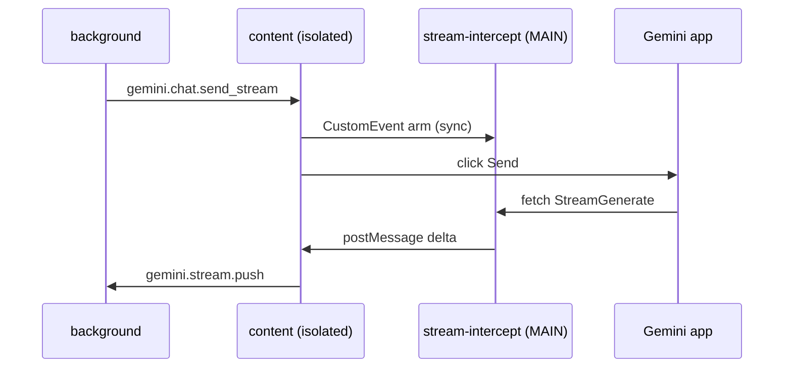

# Debug stream intercept (extension)

## Kiến trúc (2 world)

| Layer | File | World | Vai trò |
|-------|------|-------|---------|
| Hook | `entrypoints/stream-intercept.content.ts` | **MAIN** | `fetch` tee + `XHR` (port `gemini_runner.go` Route) |
| Parser | `src/lib/gemini-stream-parser.ts` | — | `chunkSplitter` + `bashProcessChunk` (port `gemini_parser.go`) |
| Bridge | `entrypoints/content.ts` | isolated | `CustomEvent` arm/disarm, `postMessage` nhận delta |
| Relay | `entrypoints/background.ts` | service worker | `gemini.stream.push` → WS `stream_push` |



## Bật debug

Trên tab `https://gemini.google.com/*`, DevTools → Console:

```js
localStorage.setItem('extract-token-stream-debug', '1');
location.reload();
```

Hoặc mở Gemini kèm query: `?extract_token_debug_stream=1`

## Xem log — console Extension (khuyến nghị)

1. Mở `chrome://extensions`
2. Bật **Developer mode**
3. Tìm **Extract Token** → **Service worker** → **Inspect** (hoặc "Inspect views: service worker")
4. Tab **Console** của cửa sổ DevTools vừa mở

Mọi log từ `intercept` (MAIN) và `content` được relay qua `chrome.runtime.sendMessage` → hiện tại đây với prefix:

`HH:MM:SS.mmm [ExtractToken:intercept] event { ... }`

Trong console service worker:

```js
__extractTokenStreamDebugBg.dump()
__extractTokenStreamDebugBg.help()
```

Trên tab Gemini (log cục bộ + relay):

```js
__extractTokenStreamDebug.dump()
__extractTokenStreamDebug.help()
```

## Log trên backend (terminal `cargo run`)

Extension gửi WS `debug_push` → backend ghi `tracing` target `tab_debug` + buffer HTTP.

- **Bật đầy đủ:** `extract-token-stream-debug=1` (mọi sự kiện)
- **Luôn gửi lỗi tab:** `*missing*`, `*failed*`, `*error*`, `*warn*`, `reload` (kể cả khi debug tắt)

Xem log terminal backend:

```text
INFO tab_debug: tab debug tab_id=123 layer=background event=tab_intercept_ready ...
```

Hoặc HTTP:

```bash
curl -s 'http://127.0.0.1:9516/v1/debug/tab?limit=50' | jq .
```

## Đảm bảo intercept trong tab

Background gọi `ensureGeminiTabScripts(tabId)`:

- Inject `stream-intercept.js` (**MAIN**, `injectImmediately`)
- Probe `window.__extractTokenStreamProbe()` → `fetchPatched: true`
- Nếu vẫn false: **reload tab một lần** rồi inject lại
- Inject `content.js` nếu ping thất bại

Chạy khi: tạo/tái sử dụng tab account, `tabs.onUpdated` (complete), trước mọi `sendMessageToGeminiTab`.

Log Extension: `tab_intercept_ready` hoặc `tab_intercept_missing`.

## Checklist khi stream không chạy

1. **Patch đã load?** — log `patches_installed` / `tab_intercept_ready` (`fetchPatched: true`).
2. **Đã arm trước Send?** — log `arm` / `armed` với `requestId` trùng `streamId` backend.
3. **Có request StreamGenerate?** — log `fetch_stream_seen` hoặc `xhr_stream_seen`.
4. **Pass-through?** — `fetch_pass_not_armed` = gửi prompt khi chưa arm (thường do race cũ với `postMessage`).
5. **Parse có delta?** — `delta_emit` với `deltaLen` > 0.
6. **Bridge content?** — `bridge_delta` → `stream_push` ở background.
7. **WS backend?** — extension connected; backend nhận `stream_push`.

## Nghiên cứu: framing body

Old Playwright dùng `bufio.Scanner` (từng dòng). Extension dùng **cả hai**:

- Length-prefixed: `<len>\n<payload>`
- Newline JSON: dòng bắt đầu bằng `[`

Nếu chỉ thấy `consume_end` mà không có `delta_emit`, bật debug và xem `tail_preview` — có thể format Gemini đổi.

## Transport

- **fetch + tee**: nhánh chính khi Gemini dùng `fetch`.
- **XHR load**: fallback khi request qua `XMLHttpRequest`.

Khi debug, so sánh `fetch_stream_tee` vs `xhr_stream_process`.
